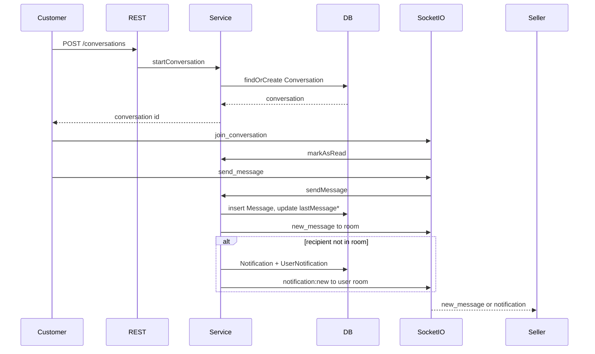

# Chat Feature Implementation Plan — Gaza-Gate

**Project layout note:** This codebase does **not** use a `src/` folder. Paths below match the real tree (`models/`, `routes/`, `config/`, etc.).

**Existing state:** `Conversation` and `Message` models + associations exist. Socket.IO is initialized in [`config/socket.config.js`](config/socket.config.js) with JWT auth and per-user rooms (`user:${userId}`). There are **no** conversation/message routes, controllers, or services yet. `socket.io` is already in [`package.json`](package.json); no Redis.

**Critical ID convention:** `Conversation.sellerId` and `Conversation.customerId` are **`User.id` values** (associations point at `User`). By contrast, `Product.sellerId`, `Order.sellerId`, and `Order.customerId` are **profile** IDs (`Seller.id` / `Customer.id`). The service layer must always resolve profile → `userId` when starting a chat from a product or order.

---

## 1. Database Review

### Already correct on `Conversation` ([`models/conversation.model.js`](models/conversation.model.js))

| Column | Purpose |
| --- | --- |
| `id` | UUID PK |
| `sellerId` / `seller_id` | Seller’s **User.id** |
| `customerId` / `customer_id` | Customer’s **User.id** |
| `sourceType` / `source_type` | Context enum (`product`, `seller`, `direct`) |
| `sourceId` / `source_id` | Polymorphic context id (product/seller/order id) |
| `lastMessageId` / `last_message_id` | Preview pointer |
| `lastMessageAt` / `last_message_at` | Sort key for inbox |
| `activeProductId` / `active_product_id` | Current product context |
| Unique index `(seller_id, customer_id)` | One conversation per pair |
| `created_at` / `updated_at` | Timestamps |

### Already correct on `Message` ([`models/message.model.js`](models/message.model.js))

| Column | Purpose |
| --- | --- |
| `id` | UUID PK |
| `conversationId` | Parent conversation |
| `senderId` | Sender’s **User.id** |
| `content` | Text body (trimmed) |
| `messageType` | Enum, currently only `"text"` |
| `productId` | Optional product attachment on a message |
| `created_at` / `updated_at` | Timestamps |
| Indexes on `conversation_id`, `sender_id` | Query support |

**Do not add** `isRead` on `Message`.

### What must be added

**A. Read receipts on `Conversation` (not on `Message`)**

Because each conversation has exactly two participants, store one timestamp per side:

- `customerLastReadAt` → `customer_last_read_at` (`DATE`, `allowNull: true`)
- `sellerLastReadAt` → `seller_last_read_at` (`DATE`, `allowNull: true`)

When the current user is the customer, use `customerLastReadAt`; when seller, use `sellerLastReadAt`.

**B. Extend `sourceType` enum** (column name unchanged)

Add `"order"` so context-aware messaging can link an order:

```js
sourceType: ENUM("product", "seller", "direct", "order")
```

Apply via model change + one-time SQL (project does not use migrations; `sequelize.sync()` is commented out in [`server.js`](server.js)):

```sql
ALTER TABLE conversations
  MODIFY COLUMN source_type ENUM('product', 'seller', 'direct', 'order')
  NOT NULL DEFAULT 'direct';

ALTER TABLE conversations
  ADD COLUMN customer_last_read_at DATETIME NULL,
  ADD COLUMN seller_last_read_at DATETIME NULL;

-- Optional but recommended for inbox sort performance
CREATE INDEX idx_conversations_last_message_at ON conversations (last_message_at);
```

### Final schemas

**`conversations`**

| Column | Type | Notes |
| --- | --- | --- |
| `id` | UUID PK | |
| `seller_id` | UUID NOT NULL | `User.id` of seller |
| `customer_id` | UUID NOT NULL | `User.id` of customer |
| `source_type` | ENUM(`product`,`seller`,`direct`,`order`) | Default `direct` |
| `source_id` | UUID NULL | Product / Seller profile / Order id |
| `last_message_id` | UUID NULL | FK-like pointer to `messages.id` |
| `last_message_at` | DATETIME NULL | Inbox sort |
| `active_product_id` | UUID NULL | Latest product context |
| `customer_last_read_at` | DATETIME NULL | **NEW** |
| `seller_last_read_at` | DATETIME NULL | **NEW** |
| `created_at` / `updated_at` | DATETIME | |
| UNIQUE(`seller_id`, `customer_id`) | | |

**`messages`** (unchanged)

| Column | Type | Notes |
| --- | --- | --- |
| `id` | UUID PK | |
| `conversation_id` | UUID NOT NULL | |
| `sender_id` | UUID NOT NULL | `User.id` |
| `content` | TEXT NOT NULL | |
| `message_type` | ENUM(`text`) | Default `text` |
| `product_id` | UUID NULL | |
| `created_at` / `updated_at` | DATETIME | |

---

## 2. Association Review

### Existing ([`models/associations.js`](models/associations.js) lines 338–403)

- `User` → `sellingConversations` / `buyingConversations` via `sellerId` / `customerId`
- `Conversation` → `seller` / `customer` (`User`)
- `Conversation` → `messages` (`Message`)
- `Message` → `conversation`, `sender` (`User`), `product` (`Product`)

### Missing (add these)

```js
// Last message preview for inbox list
Conversation.belongsTo(Message, {
  foreignKey: { name: "lastMessageId", field: "last_message_id" },
  as: "lastMessage",
  constraints: false, // avoid circular FK issues on create
});

// Active product context
Conversation.belongsTo(Product, {
  foreignKey: { name: "activeProductId", field: "active_product_id" },
  as: "activeProduct",
  onDelete: "SET NULL",
  onUpdate: "CASCADE",
});
```

`sourceId` stays polymorphic (no Sequelize association to Order/Product/Seller). Resolve context in the service when needed.

No new associations for `lastReadAt` — columns live on `Conversation`.

---

## 3. API Endpoints Plan

Mount once for both roles (same pattern as shared notification controller, but one path):

```js
// app.js
app.use("/api/conversations", conversationRoute);
```

Auth: `authenticateAccessToken` + `allowedTo(USER_ROLES.CUSTOMER, USER_ROLES.SELLER)` on all routes.

All responses use `apiResponse.sendSuccess(res, data, statusCode)`.

---

### `GET /api/conversations`

| | |
| --- | --- |
| **Who** | Customer or seller |
| **Query** | `page` (default `1`), optional `limit` (cap at project default `PAGINATION.DEFAULT_LIMIT` = 10 unless you raise it for chat) |
| **Models** | `Conversation.findAndCountAll`, include `lastMessage`, `seller`/`customer` `User`, optional `activeProduct` |
| **Rules** | Where `customerId = userId` OR `sellerId = userId`. Order by `lastMessageAt DESC` (nulls last). Explicit `attributes` only. |

**Response**

```json
{
  "status": "success",
  "data": {
    "conversations": [
      {
        "id": "uuid",
        "sourceType": "product",
        "sourceId": "uuid",
        "lastMessageAt": "2026-07-04T12:00:00.000Z",
        "unreadCount": 3,
        "otherParty": {
          "id": "uuid",
          "firstName": "Ahmad",
          "lastName": "Ali",
          "avatar": "https://...",
          "storeName": "My Store"
        },
        "lastMessage": {
          "id": "uuid",
          "content": "Hello",
          "senderId": "uuid",
          "createdAt": "2026-07-04T12:00:00.000Z"
        },
        "activeProduct": {
          "id": "uuid",
          "name": "Olive oil"
        }
      }
    ],
    "pagination": {
      "currentPage": 1,
      "totalPages": 2,
      "totalItems": 12,
      "pageSize": 10,
      "hasNextPage": true,
      "hasPreviousPage": false
    }
  }
}
```

`otherParty`: if current user is customer → seller user (+ `Seller.storeName` via `Seller.findOne({ where: { userId } })`); if seller → customer user (`storeName: null`).

`unreadCount`: see section 6.

---

### `POST /api/conversations`

| | |
| --- | --- |
| **Who** | **Customer only** (sellers reply; they do not start) |
| **Body** | At least one of: `sellerId` (Seller **profile** id), `productId`, `orderId` |
| **Models** | `Customer`, `Seller`, `Product`, `Order`, `Conversation.findOrCreate` |
| **Rules** | Resolve seller `User.id` from profile/product/order. `customerId = req.user.id`. Reject if seller user id === customer user id. Upsert on `(sellerId, customerId)`. If exists, optionally refresh `activeProductId` / `sourceType` / `sourceId` from latest context. |

**Body examples**

```json
{ "sellerId": "seller-profile-uuid" }
{ "productId": "product-uuid" }
{ "orderId": "order-uuid" }
{ "sellerId": "seller-profile-uuid", "productId": "product-uuid" }
```

**Context mapping**

| Input | `sourceType` | `sourceId` | `activeProductId` |
| --- | --- | --- | --- |
| `productId` | `product` | product id | product id |
| `orderId` | `order` | order id | null (or first order item product if desired) |
| only `sellerId` | `seller` | seller profile id | null |

For `orderId`: load order, ensure `Order.customerId` matches current user’s `Customer.id`, resolve `Order.sellerId` → `Seller.userId`.

**Response** `201` if created, `200` if existing:

```json
{
  "status": "success",
  "data": {
    "conversation": {
      "id": "uuid",
      "sellerId": "user-uuid",
      "customerId": "user-uuid",
      "sourceType": "product",
      "sourceId": "uuid",
      "activeProductId": "uuid",
      "lastMessageAt": null,
      "createdAt": "..."
    },
    "created": true
  }
}
```

---

### `GET /api/conversations/:conversationId`

| | |
| --- | --- |
| **Who** | Participant only |
| **Query** | `page` (default `1` = **most recent** page), `limit` |
| **Models** | `Conversation.findByPk`, `Message.findAndCountAll` |
| **Rules** | 404 if missing; 403 if `userId` not in `{sellerId, customerId}`. Messages: paginate from the **end** (latest page first), return each page ordered **oldest → newest** (ASC). |

**Pagination algorithm (chat-friendly)**

```js
const total = await Message.count({ where: { conversationId } });
const totalPages = Math.max(Math.ceil(total / limit), 1);
const page = Math.min(Math.max(page, 1), totalPages);
// page 1 = newest slice
const offset = Math.max(total - page * limit, 0);
const rows = await Message.findAll({
  where: { conversationId },
  attributes: ["id", "senderId", "content", "messageType", "productId", "createdAt"],
  include: [{ model: User, as: "sender", attributes: ["id", "firstName", "lastName", "avatar"] }],
  order: [["createdAt", "ASC"]],
  offset,
  limit,
});
```

**Response**

```json
{
  "status": "success",
  "data": {
    "conversation": {
      "id": "uuid",
      "sourceType": "order",
      "sourceId": "uuid",
      "otherParty": { "id": "...", "firstName": "...", "lastName": "...", "avatar": "...", "storeName": "..." },
      "activeProduct": null
    },
    "messages": [
      {
        "id": "uuid",
        "senderId": "uuid",
        "content": "Hi",
        "messageType": "text",
        "productId": null,
        "createdAt": "...",
        "sender": { "id": "...", "firstName": "...", "lastName": "...", "avatar": "..." }
      }
    ],
    "pagination": {
      "currentPage": 1,
      "totalPages": 5,
      "totalItems": 48,
      "pageSize": 10,
      "hasNextPage": true,
      "hasPreviousPage": false
    }
  }
}
```

`hasNextPage` here means “older messages exist” (page+1). Opening the thread should also call mark-read (client can call `PATCH .../read`, or the GET handler may call `markAsRead` — prefer explicit `PATCH` + socket `mark_read` so list and socket stay consistent; optionally auto-mark on GET for convenience).

**Recommendation:** Auto-call `markAsRead` inside GET details so opening the chat clears unread.

---

### `POST /api/conversations/:conversationId/messages`

| | |
| --- | --- |
| **Who** | Participant only |
| **Body** | `{ "content": "string", "productId": "uuid?" }` |
| **Models** | `Message.create`, update `Conversation.lastMessageId` / `lastMessageAt` |
| **Rules** | Non-empty content (max e.g. 5000). Same send pipeline as socket `send_message` (emit + offline notification). |

**Response** `201`:

```json
{
  "status": "success",
  "data": {
    "message": {
      "id": "uuid",
      "conversationId": "uuid",
      "senderId": "uuid",
      "content": "Hello",
      "messageType": "text",
      "productId": null,
      "createdAt": "..."
    }
  }
}
```

---

### `PATCH /api/conversations/:conversationId/read`

| | |
| --- | --- |
| **Who** | Participant only |
| **Body** | none |
| **Models** | `Conversation.update` on the correct `*LastReadAt` column |
| **Rules** | Set to `new Date()`. Emit `conversation_read` to the room (optional but useful for other party’s UI). |

**Response**

```json
{
  "status": "success",
  "data": {
    "conversationId": "uuid",
    "lastReadAt": "2026-07-04T12:05:00.000Z"
  }
}
```

---

## 4. Socket.IO Events Plan

Auth already runs in [`config/socket.config.js`](config/socket.config.js) via `token.verifyAccessToken` (same `JWT_SECRET_KEY` as REST). On connect, socket joins `user:${userId}`.

Extend `io.on("connection")` to register conversation handlers from `socket/handlers/conversation.handler.js`.

Room naming: `conversation:${conversationId}`.

Helper: `isUserInConversationRoom(io, conversationId, userId)` — iterate sockets in the room and compare `socket.userId`.

---

### `join_conversation` (client → server)

**Payload:** `{ conversationId: "uuid" }`

**Server:**

1. Auth already on socket (`socket.userId`).
2. Load conversation; ensure participant.
3. `socket.join(\`conversation:${conversationId}\`)`.
4. Call `markAsRead(userId, conversationId)`.
5. Ack: `socket.emit("joined_conversation", { conversationId })`.

**Auth:** yes (connection middleware).

---

### `send_message` (client → server)

**Payload:** `{ conversationId: "uuid", content: "string", productId?: "uuid" }`

**Server:**

1. Validate participant + content.
2. Call shared `conversationService.sendMessage(userId, conversationId, { content, productId })`.
3. Service persists message, updates conversation, emits `new_message` to room, notifies if recipient not in room.
4. Ack to sender: `socket.emit("message_sent", { message })` (optional; `new_message` already includes sender if they joined the room).

**Auth:** yes.

---

### `new_message` (server → clients in room)

**Payload:**

```json
{
  "message": {
    "id": "uuid",
    "conversationId": "uuid",
    "senderId": "uuid",
    "content": "Hello",
    "messageType": "text",
    "productId": null,
    "createdAt": "..."
  }
}
```

Emitted to `conversation:${conversationId}` (both parties if joined). Also emit to recipient’s personal room `user:${recipientId}` as `conversation:updated` (optional) so inbox list can refresh without being in the room:

```json
{
  "conversationId": "uuid",
  "lastMessage": { "id": "...", "content": "...", "senderId": "...", "createdAt": "..." },
  "lastMessageAt": "..."
}
```

---

### `mark_read` (client → server)

**Payload:** `{ conversationId: "uuid" }`

**Server:** participant check → `markAsRead` → emit to room:

**`conversation_read` (server → room):**

```json
{ "conversationId": "uuid", "userId": "uuid", "lastReadAt": "..." }
```

---

### `typing` (client → server, optional)

**Payload:** `{ conversationId: "uuid", isTyping: true }`

**Server:** participant check → `socket.to(\`conversation:${id}\`).emit("typing", { conversationId, userId, isTyping })`.

Do not persist.

---

### Disconnect

Socket.IO auto-leaves rooms. No special cleanup required. Unread/notification logic only cares whether recipient is **currently** in the conversation room at send time.

---

## 5. Service Layer Plan

File: [`services/conversation.service.js`](services/conversation.service.js)

All functions take plain values `(userId, ...)` — never `req`. Controllers pass `req.user.id`, `req.user.role`, params, body.

Use `AppError.fail(message, statusCode)` and explicit `attributes` on every query.

---

### `assertParticipant(conversation, userId)`

Throws `403` if `userId` is neither `conversation.sellerId` nor `conversation.customerId`.

---

### `getOtherPartyUserId(conversation, userId)`

Returns the other participant’s `User.id`.

---

### `resolveLastReadColumn(conversation, userId)`

Returns `"customerLastReadAt"` or `"sellerLastReadAt"`.

---

### `listConversations(userId, query)`

- `where: { [Op.or]: [{ customerId: userId }, { sellerId: userId }] }`
- `order: [["lastMessageAt", "DESC"]]`
- Include:
  - `lastMessage` → attributes `id, content, senderId, createdAt`
  - `seller` / `customer` users → `id, firstName, lastName, avatar`
  - `activeProduct` → `id, name`
- Map each row: compute `unreadCount`, build `otherParty` (attach `storeName` when other party is seller via `Seller` lookup; batch seller lookups by user ids to avoid N+1).
- Return `{ conversations, pagination }`.

---

### `startConversation(userId, role, data)`

- Require `role === customer`.
- Resolve `sellerUserId` and context from `sellerId` / `productId` / `orderId` (see section 3).
- Reject self-chat.
- `Conversation.findOrCreate({ where: { sellerId: sellerUserId, customerId: userId }, defaults: { ...context } })`.
- If found and context provided: update `sourceType`, `sourceId`, `activeProductId` as appropriate.
- Return `{ conversation, created }`.

---

### `getConversation(userId, conversationId, query)`

- Load conversation with attributes + other party includes.
- `assertParticipant`.
- Load paginated messages (section 3 algorithm).
- Call `markAsRead(userId, conversationId)` (auto-read on open).
- Return `{ conversation, messages, pagination }`.

---

### `sendMessage(userId, conversationId, { content, productId })`

Shared by REST and socket:

1. Load conversation; `assertParticipant`.
2. Validate `content` (trim, non-empty, max length).
3. Optional: if `productId`, verify product exists (and preferably belongs to conversation’s seller profile).
4. Transaction:
   - `Message.create({ conversationId, senderId: userId, content, messageType: "text", productId })`
   - `conversation.update({ lastMessageId: message.id, lastMessageAt: message.createdAt })`
5. Build message payload (explicit fields).
6. `getIO().to(\`conversation:${conversationId}\`).emit("new_message", { message })`.
7. `emitToUser(recipientId, "conversation:updated", { ... })` for inbox.
8. If `!isUserInConversationRoom(io, conversationId, recipientId)`, call `notificationService.notifySafely({...})`.
9. Return message.

---

### `markAsRead(userId, conversationId)`

1. Load conversation; `assertParticipant`.
2. Update the correct `*LastReadAt` to `new Date()`.
3. Optionally emit `conversation_read`.
4. Return `{ conversationId, lastReadAt }`.

---

## 6. Unread Count Logic

### Storage

On `Conversation`:

- Customer’s cursor: `customerLastReadAt`
- Seller’s cursor: `sellerLastReadAt`

No per-message read flag.

### Per-conversation unread (for current user)

```js
const lastReadAt =
  conversation.customerId === userId
    ? conversation.customerLastReadAt
    : conversation.sellerLastReadAt;

const unreadCount = await Message.count({
  where: {
    conversationId: conversation.id,
    senderId: { [Op.ne]: userId },
    ...(lastReadAt
      ? { createdAt: { [Op.gt]: lastReadAt } }
      : {}), // if never read, all messages from the other party count
  },
});
```

Equivalent SQL:

```sql
SELECT COUNT(*) FROM messages
WHERE conversation_id = :conversationId
  AND sender_id <> :userId
  AND (:lastReadAt IS NULL OR created_at > :lastReadAt);
```

### List performance

Avoid N+1: after loading conversations, run one grouped count query:

```js
Message.findAll({
  attributes: [
    "conversationId",
    [fn("COUNT", col("id")), "unreadCount"],
  ],
  where: {
    conversationId: { [Op.in]: conversationIds },
    senderId: { [Op.ne]: userId },
    [Op.or]: conversationIds.map((id) => {
      const lastReadAt = lastReadAtByConversationId[id];
      return {
        conversationId: id,
        ...(lastReadAt ? { createdAt: { [Op.gt]: lastReadAt } } : {}),
      };
    }),
  },
  group: ["conversationId"],
  raw: true,
});
```

Or simpler loop for v1 if inbox size is small; prefer batched approach.

Attach `unreadCount` (default `0`) on each conversation in the list response.

---

## 7. Notification Integration

### When

Inside `sendMessage`, **after** persist + socket emit, **only if** recipient is **not** in `conversation:${conversationId}` room.

Use existing [`notificationService.notifySafely`](services/notification.service.js) so failures never break chat.

### Type

Use `NOTIFICATION_TYPES.GENERAL` — there is no `MESSAGE` type; `ORDER` requires `relatedOrderId` and is wrong for free-form chat; `SYSTEM` is for platform messages.

### Payload

```js
await notificationService.notifySafely({
  recipientUserIds: [recipientUserId],
  senderId: userId,
  type: NOTIFICATION_TYPES.GENERAL,
  title: "New message",
  content: content.length > 100 ? `${content.slice(0, 100)}...` : content,
  actionUrl: `/conversations/${conversationId}`,
});
```

`notifySafely` already emits `notification:new` to `user:${id}` via `emitToUser`.

### Online check

```js
function isUserInConversationRoom(io, conversationId, userId) {
  const room = io.sockets.adapter.rooms.get(`conversation:${conversationId}`);
  if (!room) return false;
  for (const socketId of room) {
    const s = io.sockets.sockets.get(socketId);
    if (s && s.userId === userId) return true;
  }
  return false;
}
```

Recipient online elsewhere (only in `user:` room) **still gets** a notification — matches requirements.

REST and socket both go through `sendMessage`, so REST-while-socket-connected is handled correctly.

---

## 8. File Structure

```
gaza-gate-backend/
├── models/
│   ├── conversation.model.js          ← add customerLastReadAt, sellerLastReadAt; extend sourceType
│   ├── message.model.js               ← no changes
│   └── associations.js                ← lastMessage + activeProduct associations
├── routes/
│   └── conversation.route.js          ← NEW
├── controllers/
│   └── conversation.controller.js     ← NEW
├── services/
│   └── conversation.service.js        ← NEW
├── middlewares/validators/
│   └── conversation.validator.js      ← NEW
├── config/
│   └── socket.config.js               ← register conversation handlers on connection
├── socket/
│   ├── handlers/
│   │   └── conversation.handler.js    ← NEW (join, send, mark_read, typing)
│   └── utils/
│       └── room.util.js               ← NEW (isUserInConversationRoom)
├── app.js                             ← mount /api/conversations
└── server.js                          ← no change (initSocket already called)
```

**Auth middleware:** Do **not** duplicate JWT logic. Keep auth in `config/socket.config.js` (already correct). Optional later extract to `socket/middleware/auth.socket.js` if you want the folder layout from the prompt; not required for correctness.

**Patterns to mirror**

- Controllers: `asyncWrapper` + `apiResponse.sendSuccess`
- Errors: `AppError.fail(...)`
- Routes: `filterBody([...])` → validators → `requestsValidator` → controller
- Services: plain args, explicit `attributes`

---

## 9. Implementation Order

1. **DB model updates** — add `customerLastReadAt`, `sellerLastReadAt`; extend `sourceType` with `order`; run SQL `ALTER TABLE`.
2. **Associations** — `lastMessage`, `activeProduct`.
3. **Room util** — `isUserInConversationRoom`.
4. **Service core** — `startConversation`, `listConversations`, `getConversation`, `markAsRead`, `sendMessage` (without socket first, then wire emit).
5. **Validators + controller + routes** — mount in `app.js`.
6. **Socket handlers** — wire into `initSocket` connection callback; reuse service functions.
7. **Notification branch** inside `sendMessage`.
8. **Manual test matrix** — REST-only, socket-only, mixed REST+socket, offline notification, duplicate conversation, unauthorized access, pagination.

---

## 10. Edge Cases to Handle

| Case | Behavior |
| --- | --- |
| Customer messages themselves as seller | Reject `400` when `sellerUserId === customerUserId` |
| Conversation already exists | `findOrCreate`; return existing; refresh context fields |
| Non-participant reads/sends | `403` |
| Conversation not found | `404` |
| Seller calls `POST /conversations` | `403` (customers only) |
| Invalid / missing start context | `400` if none of `sellerId`, `productId`, `orderId` |
| `productId` not found or deleted | `404` |
| `orderId` not owned by customer | `403` |
| Empty / whitespace message | `400` (model trim + service check) |
| Recipient in conversation room | Emit `new_message` only; **no** notification |
| Recipient online but not in room | Emit `conversation:updated` to user room + **create** notification |
| Recipient fully offline | Notification only (+ no live `new_message` delivery) |
| Message via REST while recipient on socket in room | Same `sendMessage` path; room emit; no notification |
| Pagination page 1 empty conversation | `messages: []`, `totalItems: 0`, `totalPages: 1` |
| Pagination past last page | Clamp page to `totalPages` |
| Socket disconnect mid-chat | Auto leave room; next message may notify |
| Banned user | Existing socket/REST auth already blocks |
| Concurrent `findOrCreate` race | Unique index on `(seller_id, customer_id)`; catch unique error and re-fetch |
| `lastMessageId` set before association constraints | Use `constraints: false` on `lastMessage` belongsTo |
| Seller profile id vs user id confusion | Document API: `sellerId` in POST body is **Seller profile id**; stored `Conversation.sellerId` is **User.id** |

---

## Architecture flow



---

## Validator sketch

[`middlewares/validators/conversation.validator.js`](middlewares/validators/conversation.validator.js):

- `startConversationValidator`: optional UUIDs for `sellerId`, `productId`, `orderId`; custom check at least one present
- `conversationIdParam`: `param("conversationId").isUUID()`
- `sendMessageValidator`: `content` required string length 1–5000; optional `productId` UUID
- List/detail: optional `page` positive int

Route middleware order example:

```js
router.post(
  "/",
  authenticateAccessToken,
  allowedTo(USER_ROLES.CUSTOMER),
  filterBody(["sellerId", "productId", "orderId"]),
  startConversationValidator,
  requestsValidator,
  conversationController.startConversation,
);
```

Other routes use `allowedTo(USER_ROLES.CUSTOMER, USER_ROLES.SELLER)`.

---

This plan is implementable end-to-end without further product decisions: models already encode the pair uniqueness and User-based participants; only read-cursor columns, `order` source type, associations, service/API/socket wiring, and GENERAL notifications for offline recipients are required.