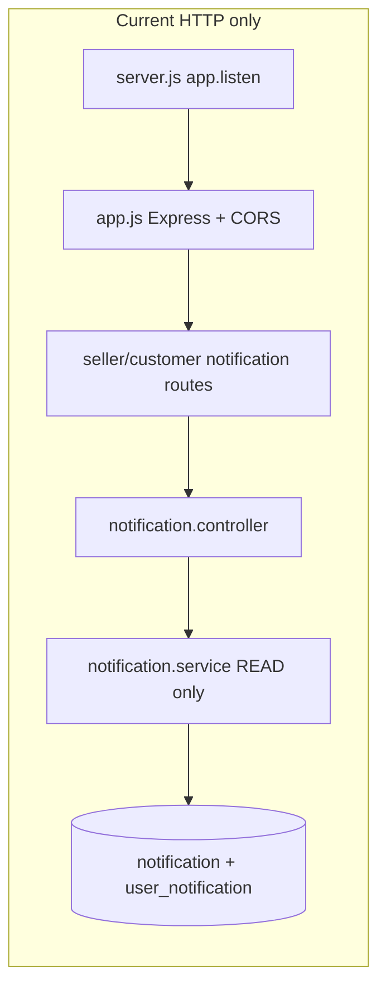

# Notification System — Phase 1 Analysis (Read-Only)

No code changes. Findings only. Wait for your confirmation before Phase 2 (Socket.IO design/implementation).

---

## A) Notification creation — read/list only; nothing produces data

**Nothing in the codebase creates notifications.**

- Project-wide search for `Notification.create`: **0 matches**
- Also no `UserNotification.create`, `bulkCreate`, or any `createNotification` helper
- [`services/notification.service.js`](services/notification.service.js) exports only:
  - `getNotifications`
  - `markAllAsRead`
  - `markAsRead`
  - `deleteAllNotifications`

Models and associations exist (`Notification`, `UserNotification`, M:N via `recipients`), and HTTP read/mark/delete endpoints exist for both seller and customer — but **no producer** (order status change, review, product, etc.) ever inserts rows.

Endpoints that exist today:

| Mount | Methods |
|-------|---------|
| `/api/seller/notification` | GET `/`, PATCH `/read-all`, PATCH `/:notificationId/read`, DELETE `/` |
| `/api/customer/notification` | Same routes, same controller |

---

## B) Unread count / stats — yes, already on GET list

`GET /` (both seller and customer) returns a `stats` object alongside `notifications` and `pagination`.

Built in `getNotificationStats` and merged in `getNotifications`:

```35:42:services/notification.service.js
  return {
    total: Object.values(map).reduce((s, c) => s + c, 0),
    order: map[NOTIFICATION_TYPES.ORDER] || 0,
    system: map[NOTIFICATION_TYPES.SYSTEM] || 0,
    product: map[NOTIFICATION_TYPES.PRODUCT] || 0,
    review: map[NOTIFICATION_TYPES.REVIEW] || 0,
    unRead: unReadCount,
  };
```

Returned shape from `getNotifications`:

```131:142:services/notification.service.js
  return {
    notifications,
    stats,
    pagination: {
      currentPage: parseInt(page),
      totalPages,
      totalItems: count,
      pageSize: limit,
      hasNextPage: parseInt(page) < totalPages,
      hasPreviousPage: parseInt(page) > 1,
    },
  };
```

Note: field is `unRead` (capital R), not `unread`. Counts by type are totals per type, not unread-per-type; only `unRead` is the unread total.

**Side note:** You flagged a missing `AppError` import — it is **present** now at line 8 of `notification.service.js` (`require("../utils/AppError.util.js")`).

---

## C) Frontend — not in this workspace

This workspace is **backend only** (`gaza-gate-backend`). Under `c:\Users\ezzat\OneDrive\Desktop\feras` there are no `.tsx`/`.jsx`/`.vue` files and no separate frontend folder visible.

CORS references `https://gaza-gate-frontend.vercel.app` and `http://localhost:3000`, so a React frontend likely exists elsewhere (separate repo / not mounted here). **Not accessible from this workspace.**

---

## D) JWT verification — exact path and signature

**Middleware** ([`middlewares/auth/verifyToken.middleware.js`](middlewares/auth/verifyToken.middleware.js)):

```js
const token = require("../../utils/token.util.js");
// ...
payload = token.verifyAccessToken(accessToken);
```

**Util** ([`utils/token.util.js`](utils/token.util.js)):

```js
const verifyAccessToken = (token) => {
  return jwt.verify(token, process.env.JWT_SECRET_KEY);
};
```

| Item | Value |
|------|--------|
| Import path (from project root) | `./utils/token.util.js` or `../utils/token.util.js` depending on caller |
| Function name | `verifyAccessToken` |
| Signature | `(token: string) => payload` (uses `jwt.verify`; throws on invalid/expired) |
| Expected payload field used by middleware | `payload.userId` (also uses `payload.role`) |

Middleware also loads `User.findByPk(payload.userId)` and rejects banned users. Socket auth should reuse `verifyAccessToken` and likely the same user/status checks.

---

## E) socket.io — not installed

[`package.json`](package.json) has **neither** `socket.io` nor `socket.io-client`. Dependencies are Express, Sequelize, JWT, etc. only.

---

## F) CORS origins — exact quote from `app.js`

```27:32:app.js
app.use(
  cors({
    origin: ["https://gaza-gate-frontend.vercel.app", "http://localhost:3000"],
    credentials: true,
  }),
);
```

Origins exactly:

1. `https://gaza-gate-frontend.vercel.app`
2. `http://localhost:3000`

---

## Architecture snapshot (relevant to Socket.IO later)



- Entry: [`server.js`](server.js) uses `app.listen(process.env.PORT)` — no HTTP server object shared for Socket.IO yet.
- Auth: Bearer access token via `authenticateAccessToken` middleware.

---

## Ready for Phase 2 when you confirm

Next phase would typically cover: attach Socket.IO to an `http.Server`, socket JWT auth reusing `verifyAccessToken`, a `createNotification` producer, emit to user rooms, and wiring producers (e.g. order status). **No implementation until you confirm.**
